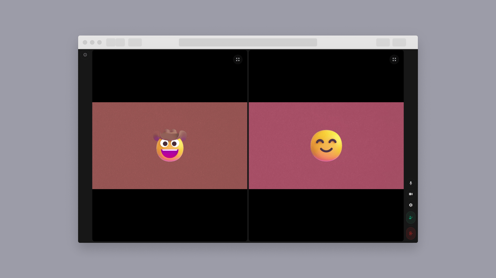

# Amazon IVS Basic Real-time Web Demo

A demo web application intended as an educational tool to demonstrate how you can build a browser-based real-time video streaming app with the [Amazon IVS Real-time Web Broadcast SDK](https://aws.github.io/amazon-ivs-web-broadcast/docs/real-time-sdk-guides/introduction).

**This project is intended for education purposes only and not for production usage.**

## Prerequisites

- [NodeJS](https://nodejs.org/) v20.10.0 and Node package manager (npm).
- `API_URL` from the deployed serverless infrastructure for this demo. To get your `API_URL` follow the instructions in the following README: [Amazon IVS Real-time Basic Web Demo Serverless Infrastructure](./infra/README.md)

## Running the demo

Follow these instructions to run the demo:

1. Run: `npm ci`
2. Run: `npm run dev`
3. Enter an `API_URL`, if prompted. The app will attempt to automatically retrieve an `API_URL` from your AWS account. If you do not have an `API_URL`, follow the instructions in the [Serverless README](./infra/README.md) of this repository.

## Known issues and limitations

- The application is meant for demonstration purposes and **not** for production use.
- This application is only tested and supported on the latest Desktop version of Chrome. Other browsers and devices, including mobile browsers and smartphones, may work with this tool, but are not officially supported at this time.
- In some instances, the Amazon IVS stage for a session may fail to delete. To remove resources manually, look for resources tagged with the key `AmazonIVSDemoResource` and value `AmazonIVSRTWebDemoResource`.
- Sessions will automatically be deleted 24 hours after creation. Users will be kicked automatically from the session when it is deleted.

## About Amazon IVS

Amazon Interactive Video Service (Amazon IVS) is a managed live streaming and stream chat solution that is quick and easy to set up, and ideal for creating interactive video experiences. [Learn more](https://aws.amazon.com/ivs/).

- [Amazon IVS docs](https://docs.aws.amazon.com/ivs/)
- [User Guide](https://docs.aws.amazon.com/ivs/latest/userguide/)
- [API Reference](https://docs.aws.amazon.com/ivs/latest/APIReference/)
- [Setting Up for Streaming with Amazon Interactive Video Service](https://aws.amazon.com/blogs/media/setting-up-for-streaming-with-amazon-ivs/)
- [Learn more about Amazon IVS on IVS.rocks](https://ivs.rocks/)
- [View more demos like this](https://ivs.rocks/examples)

## Security

See [CONTRIBUTING](CONTRIBUTING.md#security-issue-notifications) for more information.

## License

This library is licensed under the MIT-0 License. See the LICENSE file.
