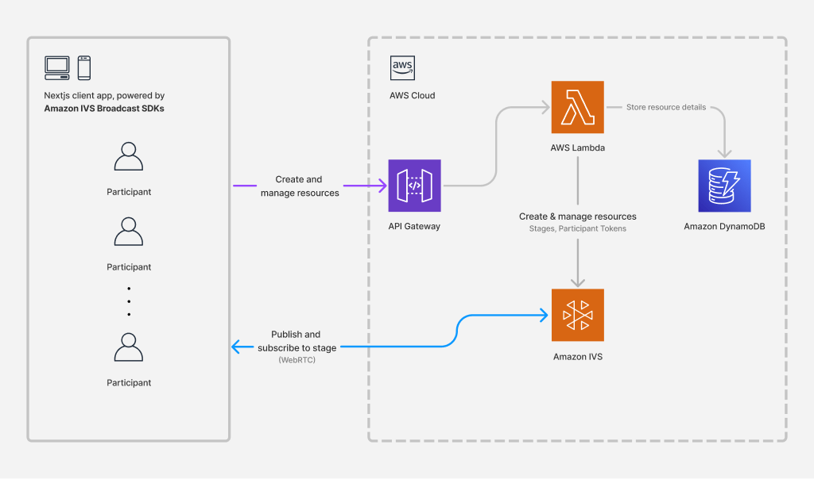

# Amazon IVS Real-time Basic Web Demo Serverless Infrastructure

This readme includes instructions for deploying the serverless infrastructure for the Amazon IVS Real-time Basic Web Demo to an AWS Account.

**\*IMPORTANT NOTE:** Deploying this demo application in your AWS account will create and consume AWS resources, which will cost money.\*

## Application overview



A full description of the diagram is available in the [architecture description](./architecture-description.md).

## Prerequisites

- [AWS CLI Version 2](https://docs.aws.amazon.com/cli/latest/userguide/install-cliv2.html)
- [NodeJS](https://nodejs.org/en/) and `npm` (npm is usually installed with NodeJS).
  - If you have [node version manager](https://github.com/nvm-sh/nvm) installed, run `nvm use` to sync your node version with this project.
- Access to an AWS Account with at least the following permissions:
- Create IAM roles
  - Create Lambda Functions
  - Create Amazon IVS Stages
  - Create Amazon S3 Buckets
  - Create Amazon DynamoDB Tables

### Configure the AWS CLI

Before you start, run the following command to make sure you're in the correct AWS account (or configure as needed):

```bash
aws configure
```

For configuration specifics, refer to the [AWS CLI User Guide](https://docs.aws.amazon.com/cli/latest/userguide/cli-chap-configure.html)

## Deploy this app to AWS

With NodeJS and NPM installed, take the following steps:

1. Install the required packages: `npm ci`
2. Bootstrap the required resources: `npm run bootstrap`
3. Run the application: `npm run deploy`

### Use your deployed backend in the client application

When the deployment successfully completes, copy the URL provided in the `Outputs` of the script. You may need to enter this URL when running the client app. The URL will be similar to the following format:

```bash
https://<ID>.execute-api.<REGION>.amazonaws.com/prod/
```

### Accessing the deployed application

If needed, you can retrieve the Cloudformation stack outputs by running the following command:

```bash
aws cloudformation describe-stacks --stack-name AmazonIVSRTWebDemoStack \
--query 'Stacks[].Outputs'
```

## Cleanup

To delete all resources associated with this demo, **including the DynamoDB table!** run the following command:

```base
npm run destroy
```

This command may not delete all associated Amazon IVS stages. Visit the [Amazon IVS web console](https://console.aws.amazon.com/ivs/) to delete any lingering resources.

## Known issues

- In some instances, the Amazon IVS stage fail to delete. To remove resources manually, look for resources tagged with the key `AmazonIVSDemoResource` and value `AmazonIVSRTWebDemoResource`.
- Sessions will automatically be deleted 24 hours after creation. Users will be kicked automatically from the session when it is deleted.
