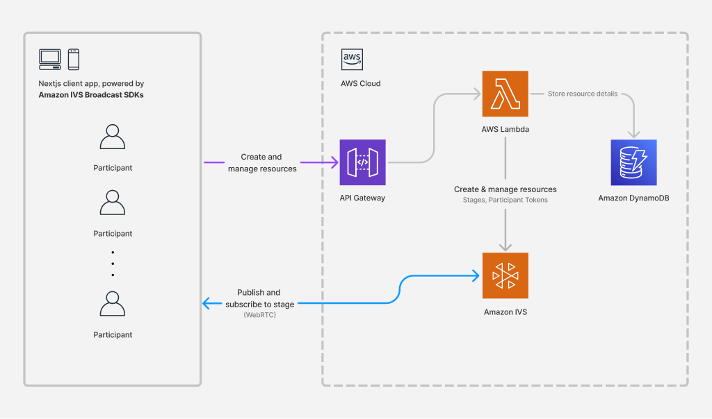

# App architecture description

<figure>

<figcaption>

This diagram illustrates the architecture of this demo backend and how it interacts with the broadcast and playback clients. The diagram has two sections from left to right. The first section has an illustration of a computer and mobile phone with a title "Nextjs client app, powered by Amazon IVS Broadcast SDKs". The section contains three icons of a user with the label "Participant". Two arrows connect the first section to the second section. From top to bottom, the first arrow is purple and connects the first section to API gateway in the second section and is labelled "Create and manage resources". The second arrow is blue and connects the first section to Amazon IVS and is labelled "Publish and subscribe to stage (WebRTC)".

The second section is titled "AWS Cloud" and contains four icons. From left to right, the first icon is the Amazon API Gateway logo and is titled "API Gateway". It is connected by an arrow to an icon with the AWS Lambda logo and is titled "AWS Lambda". The AWS Lambda icon has an arrow on the right side labeled "Store resource details", which is connected an icon of the Amazon DynamoDB logo titled "Amazon DynamoDB". The AWS Lambda icon has another arrow on the bottom side of the icon labeled "Create & manage resources. Stages, Participant Tokens" that is connected to an icon of the Amazon IVS logo titled "Amazon IVS".

</figcaption>
</figure>
